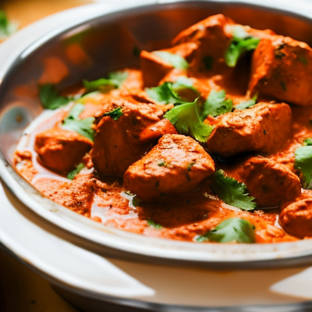

# The Carabao Cup Draw, Chicken Tikka Masala, and the Glass Onion

\
23-12-2022\
By [Tatiana Smith](../authors/3.md)

As an award-winning, 28-year-old opinion writer, I have the unique privilege of being able to bring my influential voice, passion, articulation, and keen eye to the conversation. Through my work in prestigious publications and as a social justice advocate, I strive to be unafraid and inspiring. This article seeks to illustrate how seemingly disparate topics - the Carabao Cup draw, Chicken Tikka Masala, and the Glass Onion - can be intertwined to create a compelling narrative.

The Carabao Cup draw is an exciting event in the English football season. This is the draw that determines the fate of the teams who will face off against each other in the competition. It is an important event that attracts millions of watchers, as it signals the start of the tournament. Every team has a chance to make an impact on the competition, and this draw is the beginning of the journey. This draw also presents an opportunity for teams to make a statement and prove their worth, as each team will have a chance to compete for a spot in the semi-finals, and then ultimately the finals. The draw is also important for the teams, as it gives them an opportunity to prepare and strategize for the upcoming tournament. All in all, the Carabao Cup draw is an exciting event that shapes the English football season.

Chicken tikka masala is a dish that has become a staple of British cuisine since its introduction in the 1970s. It is a dish of Indian origin, traditionally a combination of chicken tikka, cream, tomatoes, and a blend of spices. The dish is beloved in the UK and has become a symbol of the country's diversity through its hybridization of Eastern and Western cuisine. It is even said that chicken tikka masala was first created in Britain, and has been called "a true British national dish" by some. Its cultural significance is undeniable, and it has become an iconic part of British cuisine.

The glass onion has long been a symbol of layers, complexity, and mystery. It has been said to represent the many layers of the human experience, each layer representing a different level of understanding and emotion. The metaphor of the glass onion can be applied to many aspects of our lives, including our relationships, our careers, and even our thoughts. It serves to remind us that there is always more to life than meets the eye. It has a rich cultural history, spanning centuries and continents, and has been used as a symbol in songs, stories, and artwork. It is an image that is both timeless and meaningful, and can help to bring clarity to our lives when we are feeling overwhelmed. It is a reminder that life is more complex than it appears, but that we can use this complexity to our advantage.

In this article, I have explored the significance of the Carabao Cup draw, Chicken Tikka Masala, and the Glass Onion. Although these topics may seem unrelated on the surface, they all represent a deep-seated and powerful cultural heritage. Through the Carabao Cup draw, we can observe the excitement and fervor that football brings to a nation, while Chicken Tikka Masala and the Glass Onion represent the unique flavors, history, and symbolism that exist in Britain today. As these traditions are passed down from generation to generation, it is important to recognize the power that culture has to shape our identity and collective experience. I urge readers to seek out opportunities to learn and appreciate the cultural richness that exists in our lives.

