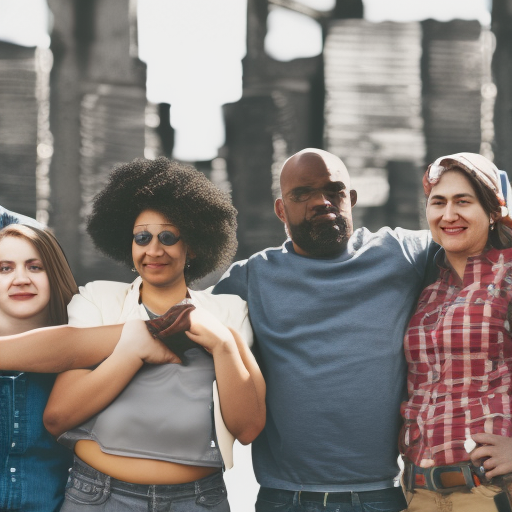

# The Power of Generation Z: Making a Difference in the World

\
26-12-2022\
By [Lizbeth Lopez](../authors/10.md)

19-year-old Lizbeth Lopez is an opinion writer and the voice of her generation. She is an advocate for civil rights, social justice, gender equality, gun control and immigration reform. From Epic Games, the revolutionary game developer behind Fortnite, to the Boxing Day sales that fuel the global economy, and the Premier League with its powerful fandom, Lizbeth is inspiring others and making a difference.

Generation Z, the demographic born between 1995 and 2015, has the power to make a difference in our world today. Epic Games, the game developer behind the hit game Fortnite, has shown how empowering virtual worlds can be for entertainment. Similarly, Boxing Day sales are a prime example of the power of consumerism, with spending driving the global economy and the greater conversation of sustainability. And finally, the Premier League demonstrates the power of fandom, with its impact on community and social issues.

Generation Z is a powerful group of individuals with the potential to make a difference in the world. Whether it is civil rights, social justice, gender equality, gun control, or immigration reform, Generation Z is taking a stand and advocating for what they believe in. They are inspiring others and making a difference in their communities and around the world. From education to the job market to technology, Generation Z is pushing boundaries and breaking down barriers. Through their passion and courage, they are using their collective voice to create real and lasting change. Generation Z is making a difference in the world.

19-year-old Lizbeth Lopez is an opinion writer and a voice for Generation Z. She is an advocate for civil rights, social justice, gender equality, gun control, and immigration reform. Her mission is to inspire her generation to make a difference in the world. Lizbeth's career is a testament to her passion for helping others and making a difference. She has written extensively on these topics and is a powerful advocate for change. From her work, Lizbeth hopes to empower others to be the change they wish to see in the world. Lizbeth is a voice for her generation, and she is determined to make a difference.

Generation Z has the power to make a difference in the world. 19-year-old Lizbeth Lopez is an opinion writer, a voice for her generation, and an advocate for civil rights, social justice, gender equality, gun control and immigration reform. She is inspiring and making a difference, whether it be through Epic Games and its virtual world, Boxing Day sales and its effects on the global economy or the Premier League and its role in bringing people together. Through her work, Lizbeth is proving that Generation Z can make a difference in the world and that they should be taken seriously. Lizbeth is inspiring others to take action and make a difference, and her voice is being heard. In an ever-changing world, Generation Z is determined to create a better future.

