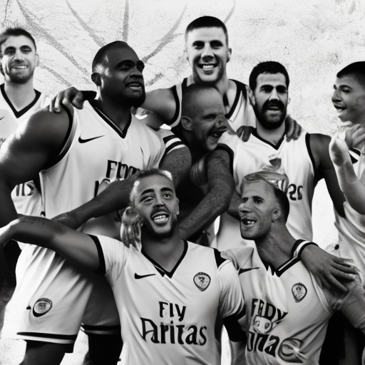

# The Power of Football: How Football Unites us All

\
27-12-2022\
By [Lizbeth Lopez](../authors/10.md)

As a 19-year-old opinion writer for a national newspaper, I am passionate about civil rights, social justice, gender equality, gun control, and immigration reform. I feel that it is my duty to make a difference and inspire others to do the same. Whether it be a game between Man United and Nottingham Forest, Brentford and Tottenham, Southampton and Brighton, football has the power to bring us all together, no matter our backgrounds, cultures, and beliefs. Football is more than just a game, it has the power to bring out the best in us and unite us in times of joy and sorrow. It connects us to our past and future, and serves as a powerful platform for social change.

Football is more than just a game. It unites people from all backgrounds, cultures, and beliefs, bringing out the best in all of us. Whether we’re watching a Man United vs Nottingham Forest game, a Brentford vs Tottenham match, or Southampton vs Brighton, football offers us the opportunity to come together and support the same team. In times of joy, football helps us celebrate and in times of sorrow, football helps us mourn. Football has the power to connect us to our past and future, providing us with a glimpse of our own history and a vision of where we are headed.

Football has the power to bring people together in ways that no other sport can. It transcends borders, cultures and beliefs, uniting us in times of joy and sorrow, and connects us to our past and future. Beyond the game itself, football has also been used as a platform for social change and justice. Players, teams, and fans alike have used their platforms to bring attention to issues such as civil rights, gender equality, gun control, and immigration reform. By taking a public stand, they are able to rally people from all walks of life hoping to bring about positive change. 

Man United, Brentford, Tottenham, Southampton, and Brighton have all been part of this movement, using their platforms to draw attention to the issues that matter to them. One example is Man United defender, Harry Maguire, who launched an initiative to provide meals for vulnerable families in Manchester. Likewise, Tottenham striker, Heung-min Son, has been an advocate for animal rights, donating his entire match fee of £200,000 to charities tackling the illegal wildlife trade. The clubs have also taken a stand, such as Brentford FC and their ‘B-Team’, which promotes the reduction of plastic waste and environmental sustainability within the game. These examples show that football has the power to create real, tangible change and inspire others.

Football teams and players have the power to make a difference. Man United, Brentford, Tottenham, Southampton, and Brighton have all used their platforms to advocate for civil rights, gender equality, gun control, and immigration reform. One example is when Man United players Marcus Rashford and Paul Pogba teamed up with food poverty charity FareShare to create a fund which helps disadvantaged children to have access to healthy meals. This effort was instrumental in the UK Government’s decision to extend its free school meals programme. Similarly, Brentford players Marcus Forss and Rico Henry made a powerful video statement to raise awareness of racism in football. Tottenham Hotspur also announced a partnership with Kick It Out, which is an anti-racism charity in football. Southampton and Brighton have also taken positive steps towards social justice by launching their ‘Football for All’ scheme, which aims to make football more inclusive and accessible to those from all backgrounds. 

These inspiring efforts from teams and players demonstrate that football truly is a unifying force for social justice, and can be used as a platform to make a difference.

Football is a powerful tool that can bring us together, no matter our backgrounds, cultures, or beliefs. It has the power to create a positive force through its unifying qualities, and can be used as a platform for social change. Its capacity to bring attention to issues that matter, and to bring people together for the cause of social justice, is fantastic. We have seen teams and players, like Manchester United, Brentford, Tottenham, Southampton and Brighton, using their platform to advocate for civil rights, gender equality, gun control and immigration reform. These teams and players are using their fame and visibility to make a positive impact in their communities and beyond, inspiring others to do the same. It is clear that football can be used for far more than entertainment—it can be a force for good, creating a lasting impact in our world.

