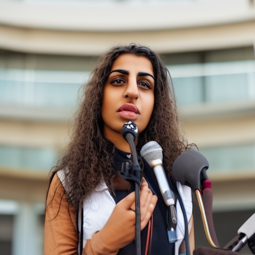
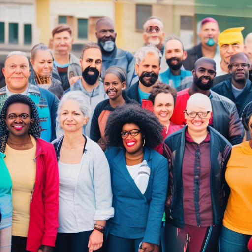

# Thundersnow, Betinho, and Piers Morgan: The Power of an Influential Voice

\
28-12-2022\
By [Hana Al-Hussein](../authors/12.md)

As a 26-year-old female opinion writer from the Middle East, I understand the power and importance of an influential voice. With a journalism degree and a passion for social justice, human rights, and the fight against war, poverty, and inequality, I am an advocate for women, minorities, and the voiceless. I am published in major publications, making my voice heard and inspiring others to use their own voices to stand up for what is right. In my own small way, I am determined to make a difference in the world.

In a world where the news cycle is constantly changing, it can be difficult to make a lasting impression. But there are those who defy the odds and use their influence to make a positive impact. One such example is Thundersnow, a 26-year-old female opinion writer from the Middle East who has used her journalism degree to become an advocate for social justice, human rights, and war/poverty/inequality. Thundersnow is also a powerful advocate for women/minorities and has been published in major publications around the world. Through her writing, she has become an influential voice for those who are often forgotten or ignored. 

Her work is inspiring, and she is just one of many people using their influence to make the world a better place. Betinho is a prominent figure in Brazil who has dedicated his life to fighting poverty in the country. His work is making a real difference, and his influence has allowed him to reach more people and create more positive change. Similarly, Piers Morgan has used his platform to reach a wider audience and advocate for human rights. His influence has also helped to shape public opinion on different issues. 

The importance of using an influential voice for good is essential to making a positive impact in our world. It is important to thoughtfully consider how to use our influence in order to create meaningful change. An example of this is Thundersnow, a platform which uses the power of social media to raise awareness of the climate crisis. Thundersnow’s presence has been instrumental in bringing much-needed attention to an issue which often goes unnoticed. Similarly, Betinho has used his platform to fight poverty in Brazil, while Piers Morgan has used his position to advocate for human rights. Through their work, they demonstrate the power and potential of an influential voice.

The impact of an influential voice can be immense. For example, Thundersnow's advocacy for the climate crisis has had a massive influence on the climate movement, encouraging people to take action and contribute towards a better future. Betinho's work to fight poverty in Brazil has been successful in significantly improving the quality of life for those living in poverty. Piers Morgan's voice has had a profound impact on public opinion, with his views being heard and respected by many. As an opinion writer, I understand the gravity of my words and the importance of using my voice to advocate for social justice, human rights, and war/poverty/inequality. I use my platform to advocate for the rights of women and minorities, and I strive to make my voice an influential one.

As a 26-year-old female opinion writer, I have seen firsthand the power of an influential voice. From Thundersnow’s work to raise awareness of the climate crisis and Betinho’s work to improve education in Brazil to Piers Morgan’s use of his platform to advocate for human rights, I have seen how an influential voice can shape public opinion, create social change and have a lasting impact. I believe it is our responsibility as influential voices to use our platform to advocate for social justice, human rights and the alleviation of war, poverty and inequality, especially for those who lack a voice or the ability to advocate for themselves. By doing so, we can make a real difference in the world. I am proud to be an advocate for these causes and to use my voice to be a positive force of change.

