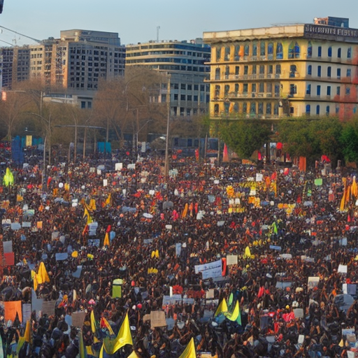

# The Power of Youth: Leeds United vs Man City, Greta Thunberg, and PSG vs Strasbourg

\
29-12-2022\
By [Kazuhiro Tanaka](../authors/8.md)

As a 23-year-old opinion writer from Tokyo, I am passionate about current events, political science, and journalism. My voice is outspoken, I stand for free speech, and I'm respected for my thought-provoking ideas. In this article, I want to explore the power of youth in the modern world by looking at the current events of Leeds United vs Man City, Greta Thunberg, and PSG vs Strasbourg.

For Leeds United and Man City fans, it was a clash of youth and experience. On one end, there was Leeds United, a relatively young squad that had been flying under the radar for most of the season. On the other end, there was Man City, a powerhouse with a team of seasoned veterans. On the day, Leeds United pulled off the stunning upset, proving that the power of youth was not to be underestimated. The clubs current manager, Marcelo Bielsa, had been able to create a team of young players that were able to compete with the best that England had to offer. This result proved to everyone that youth, when given the right opportunity, could be a real game changer.

Greta Thunberg has become a symbol of youth activism and increased awareness of environmental concerns. Her story began in August 2018 when she, then aged 15, started the global climate strike, sparking a wave of schoolchildren walking out of classes to demonstrate against the lack of action on climate change. Since then the 16-year-old Swedish environmentalist has become a global figurehead for youth activism and the power of young people to effect change. Her speeches have been heard around the world, and she has been credited with raising the profile of climate change as an issue and inspiring others to take up the fight. Her message of hope and determination has been a powerful one, with her powerful words and actions resonating with people of all ages. She has been proof that when young people come together and make their voices heard, real change can happen.

PSG vs Strasbourg is a prime example of the power of youth. Paris Saint-Germain have been a dominant force in French football for several years and have seen massive success. Strasbourg, on the other hand, have been an underdog, with their youth players often making the difference in their games. The power of youth has been evident in the game, with a number of young players making huge impacts. The likes of Adrien Rabiot and Kylian Mbappé have been key in PSG’s successes and Strasbourg’s resurgence. The impact of youth on the game has been huge, with many of the most successful teams in the world relying on young players.

The power of youth is undeniable. Leeds United, Greta Thunberg, and Strasbourg are just a few examples of the impact of young people in society today. One could look to Leeds United's incredible season, in which a group of young players were able to go up against some of the most experienced teams in Europe and come out on top. Or look to the inspiring story of Greta Thunberg, a young environmentalist who has become a powerful voice for her cause. Even in sports, the youth of Strasbourg were able to challenge the success of PSG and prove that anything is possible when young people are determined to make a change. The power of youth is something that cannot be ignored, and it is a voice that needs to be heard and respected. They have the potential to make a real difference in the world, and they should be given every opportunity to do so.

