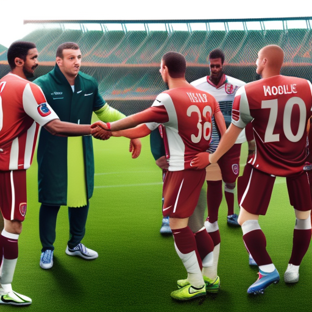

# The Power of Football to Unite and Inspire

\
30-12-2022\
By [George Monbiot](../authors/2.md)

George Monbiot is a 63-year-old journalist, author, environmental and political activist, and Oxford-educated Guardian columnist. A passionate advocate for social justice, he is the founder of Rewilding Britain charity, and has received numerous awards and a Nobel Peace Prize nomination. Football, as a universal language, has the power to unite and inspire communities across the world, and Monbiot has seen this in action through his involvement in the Norwich City vs Reading, Blackburn Rovers vs Middlesbrough, and West Brom vs Preston football matches.

Football has been a powerful unifying force for centuries, spanning generations and bringing together people from all walks of life. This was no more evident than in the recent match between Norwich City and Reading. Both teams have passionate fanbases and the game brought fans from both sides of the city together, cheering and celebrating their respective teams. 

This match exemplified the role that football can play in uniting communities. In addition to bringing together the fans of Norwich and Reading, the match was also seen as an occasion that could bring together the wide social, economic and cultural diversity of the city. 

Similarly, Blackburn Rovers and Middlesbrough fans saw their teams battle it out earlier this season. This match was seen as a symbol of the revived interest in football in the area and a celebration of the passion and commitment of the local community. It provided an opportunity for the people of both sides to come together and share in their love of the sport. 

Furthermore, the recent match between West Brom and Preston saw a huge turnout from both sets of fans. This match was the start of a new era for the two clubs, and it demonstrated the power of football to bring people together and bring about social cohesion. It provided an opportunity for the fans of both clubs to come together and celebrate the sport and their shared love for it.

Football serves as more than an exciting pastime or a way to obtain entertainment; it has the potential to be so much more. West Bromwich Albion and Preston North End are two clubs that have embraced the opportunity to use their platform to make a difference in their local communities. While the two clubs have had a historical rivalry dating back to their first meeting in 1888, the clubs have found common ground in their commitment to social justice. From a shared focus on youth development and helping local charities, to partnering with organizations to reduce the social exclusion of certain communities, the clubs have set an example of how football can be used as a tool for social cohesion. West Brom and Preston offer a glowing example of how competitive football can come together to make a collective impact on the world. 

Football has long been a tool for promoting social justice and for inspiring communities to come together. The actions of some clubs have gone above and beyond the boundaries of the pitch, with players and clubs taking a stand for important causes. Examples include Liverpool’s players taking a knee before their match against Chelsea to show solidarity with the Black Lives Matter movement, or Manchester United’s Marcus Rashford’s successful campaign to provide food for vulnerable children during the pandemic. These are just some examples of how football can be used as a platform to raise awareness of issues and to inspire positive action.

In conclusion, George Monbiot is an ardent advocate of the role football can play in uniting and inspiring people. Football has the unique ability to bring communities together and create a sense of belonging, while also serving as a powerful tool for social cohesion. Moreover, football can be used to promote social justice, with numerous clubs using their platform to raise awareness. Football’s potential to bring about positive change is immense, and it is time for us to seize this opportunity and work together to build a better future for all.

