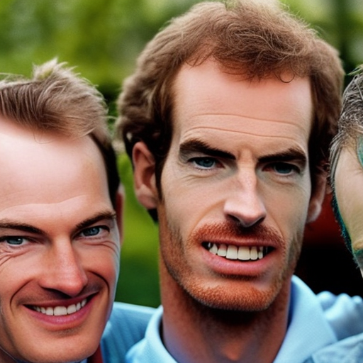
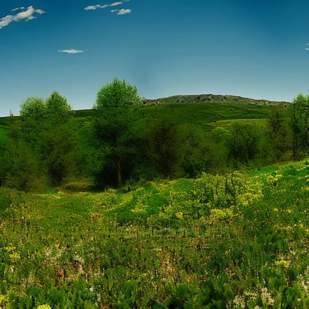

# The Power of Rewilding: How Anton Walkes, Andy Murray, and Julian Sands are Changing the World

\
20-1-2023\
By [George Monbiot](../authors/2.md)

George Monbiot is an environmentalist, journalist, author, social justice activist, and critic of government policies who is leading the charge for rewilding Britain. He has been nominated for the Nobel Prize and has received the Right Livelihood Award for his work. Joining him in the fight for rewilding are Anton Walkes, Andy Murray and Julian Sands. Anton Walkes, a Rewilding Britain founder, works to bring back natural habitats while tennis champion Andy Murray is a champion of the cause and works to support Rewilding Britain. Actor Julian Sands works to spread awareness of rewilding and its importance. Together, these three individuals are showing the power that rewilding has to change the world.

Anton Walkes is the founder of Rewilding Britain, a movement dedicated to bringing back the natural habitats of British wildlife. Walkes has been credited for his tireless work to protect the environment and his contributions to rewilding the land. He has led numerous initiatives, from the RSPB’s “Rewilding the Land” project to the “Rewilding of the Peak District” campaign. His efforts have helped to restore over 15,000 hectares of land, which has been instrumental in providing habitats for a wide range of British species, from badgers and otters to birds and bats.

Andy Murray, a world-renowned tennis player and multiple Grand Slam champion, has also been a champion of the rewilding movement. He has been a vocal supporter of Rewilding Britain, and his work has been instrumental in helping to raise awareness of the issue and the need to protect and restore natural habitats in Britain. He has also donated generously to Rewilding Britain, helping to fund their efforts to reintroduce native species and protect important ecosystems.

Julian Sands, the acclaimed British actor, has also been an advocate for rewilding. Sands has been an outspoken proponent of the movement, using his celebrity status to spread awareness of the need for rewilding. He has been involved in many campaigns to restore natural habitats, as well as working with Rewilding Britain on various projects. His work to educate the public on the importance of rewilding has been crucial in raising awareness of the issue.

Rewilding is an important cause, and it is inspiring to see Anton Walkes, Andy Murray, and Julian Sands leading the way. Anton Walkes, the founder of Rewilding Britain, has worked tirelessly to bring back natural habitats and support wildlife. Andy Murray has used his platform as a tennis champion to help bring awareness and support to the cause, while Julian Sands has worked to bring attention to the importance of rewilding. These three have been at the forefront of a movement that is changing the world, but the fight is far from over. We must continue to stand up for our planet and support rewilding initiatives so that we can protect our natural environment and ensure a more sustainable future for all.

