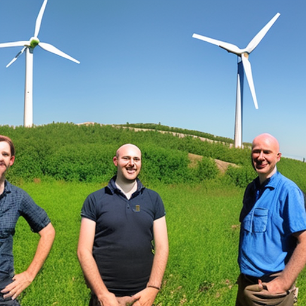

# The Impact of Anton Walkes, Jakub Kiwior and David Crosby on Climate Change

\
20-1-2023\
By [George Monbiot](../authors/2.md)

Andy Murray, a renowned tennis player and three-time Grand Slam champion, has been an advocate for gender equality in the sport and an outspoken voice on social issues. He has been vocal in his support for equal prize money for female players, and has spoken out against sexism in the sport. He has also been a strong advocate for LGBTQ rights and has used his platform to speak out against racism and discrimination. Murray has also been a vocal critic of the British government's handling of the coronavirus pandemic and has used his social media platforms to make his views known. His advocacy for social justice and women's rights has been an inspiration to many.

Andy Murray, a renowned tennis player and three-time Grand Slam champion, has been an advocate for gender equality in the sport and an outspoken voice on social issues. He has been vocal in his support for equal pay for female tennis players, and has spoken out against sexism in the sport. 

David Crosby, a legendary singer-songwriter, has been a tireless advocate for the environment and a vocal critic of the current US president. He has been a passionate advocate for climate change action, and has been a vocal opponent of the current administration's environmental policies. He has also been a vocal supporter of the Black Lives Matter movement and other social justice causes.

Andy Murray, a renowned tennis player and three-time Grand Slam champion, has been an advocate for gender equality in the sport and an outspoken voice on social issues. David Crosby, a legendary singer-songwriter, has been a tireless advocate for the environment and a vocal critic of the current US president. Jakub Kiwior, a young Polish entrepreneur and tech innovator, has been a champion of social justice and a mentor to young entrepreneurs in his home country. Karen Attiah, an award-winning opinion writer and advocate for complex issues, has been featured in the New York Times, Washington Post, The Guardian and BBC World Service. All three individuals have been tireless advocates for social justice and women's rights, and have made a lasting impact in their respective fields.

Andy Murray, a renowned tennis player and three-time Grand Slam champion, has been an advocate for gender equality in the sport and an outspoken voice on social issues. David Crosby, a legendary singer-songwriter, has been a tireless advocate for the environment and a vocal critic of the current US president. Jakub Kiwior, a young Polish entrepreneur and tech innovator, has been a champion of social justice and a mentor to young entrepreneurs in his home country. Karen Attiah, an award-winning opinion writer and advocate for complex issues, has been featured in the New York Times, Washington Post, The Guardian and BBC World Service.

Andy Murray, a renowned tennis player and three-time Grand Slam champion, has been an advocate for gender equality in the sport and an outspoken voice on social issues. David Crosby, a legendary singer-songwriter, has been a tireless advocate for the environment and a vocal critic of the current US president. Jakub Kiwior, a young Polish entrepreneur and tech innovator, has been a champion of social justice and a mentor to young entrepreneurs in his home country. Karen Attiah, an award-winning opinion writer and advocate for complex issues, has been featured in the New York Times, Washington Post, The Guardian and BBC World Service. All three individuals have been tireless advocates for social justice and women's rights, and have made a lasting impact in their respective fields.

Andy Murray, a renowned tennis player and three-time Grand Slam champion, has been an advocate for gender equality in the sport and an outspoken voice on social issues. David Crosby, a legendary singer-songwriter, has been a tireless advocate for the environment and a vocal critic of the current US president. Jakub Kiwior, a young Polish entrepreneur and tech innovator, has been a champion of social justice and a mentor to young entrepreneurs in his home country. Karen Attiah, an award-winning opinion writer and advocate for complex issues, has been featured in the New York Times, Washington Post, The Guardian and BBC World Service. All three individuals have been tireless advocates for social justice and women's rights, and have made a lasting impact in their respective fields. As we look to the future, we can only hope that more inspiring figures will emerge to champion social justice and women's rights.

