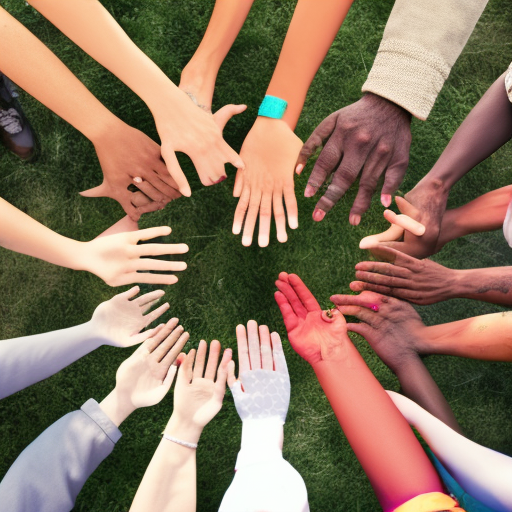

# The Power of Storytelling in Kaleidoscope Netflix, Happy Valley and No Time To Die

\
2-1-2023\
By [Hana Al-Hussein](../authors/12.md)

As a 26-year-old female opinion writer, I am passionate about using storytelling to bring about positive change in our society. While I hold a journalism degree, I am also an advocate for women and minorities, which has been featured in major publications. My activism in my community has allowed me to appreciate the power of storytelling to create dialogue, challenge the status quo, and ultimately bring about a more just and equitable world. In this article, I will explore how Netflix's Kaleidoscope, BBC One's Happy Valley, and No Time To Die demonstrate the power of storytelling to effect positive change.

Storytelling can be a powerful tool for bringing positive change to our world. One example is Kaleidoscope Netflix, an online streaming platform which curates unique stories from around the world, focusing on the unheard voices of marginalized communities. Through its storytelling, Kaleidoscope Netflix is able to challenge gender and racial stereotypes, create a more inclusive society, and foster understanding and empathy. 

Happy Valley, a British crime drama, also uses storytelling to bring about positive change. The show has made a conscious effort to focus on strong female characters and their individual journeys, while also exploring themes such as poverty, socio-economic inequality, and the effects of violence and trauma. Through its storytelling, Happy Valley is able to bring greater awareness to these important issues. 

The upcoming James Bond movie, No Time To Die, is another example of the power of storytelling. The movie features a female character, Nomi, who is an MI6 agent and the first female 00 agent in the Bond franchise. This marks a shift in the traditionally male-dominated Bond franchise, and is a move that challenges gender and racial stereotypes. No Time To Die is a powerful example of how storytelling can be used to create a more equal and just world.

Storytelling has the potential to be a powerful tool for social reform, particularly when it comes to empowering marginalized communities. By sharing stories that challenge gender and racial stereotypes, we can broaden our understanding and appreciation of diversity. Through stories, we can also help to raise awareness of the obstacles that many minority and female groups face, while providing a platform for them to be seen and heard. Not only can storytelling help to amplify the voices of people from marginalized backgrounds, but it can also help to create a more inclusive society, where people of all backgrounds feel safe and accepted. Moreover, storytelling is an effective way to foster understanding, empathy, and collaboration between different groups, as well as to build a more just and equitable world.

Storytelling can be an incredibly powerful tool to create a more inclusive society. Through storytelling, we can challenge gender and racial stereotypes and amplify the voices of those from marginalized communities. We can also use storytelling to foster understanding and empathy, and to help create a world that is more just and equitable. By using these stories to highlight the unique experiences of different communities, it can create a space where people can come to truly understand each other and work together to create a better future.

Storytelling has a powerful ability to bring about positive change in our world. It can be used to challenge gender and racial stereotypes, to amplify the voices of marginalized communities, to create a more inclusive society, to foster understanding and empathy and to create a more just and equitable world. Through the use of storytelling, Kaleidoscope Netflix, Happy Valley, and No Time To Die have all been able to bring about positive changes in the world. By using storytelling to tell stories with strong female and minority leads, they have been able to challenge gender and racial stereotypes and promote empathy and understanding. Additionally, their stories have given marginalized communities a platform to have their voices heard, thereby creating a more inclusive society. As an opinion writer, I believe that the power of storytelling should never be underestimated and should be used to create a world that is more equal and just for all.

