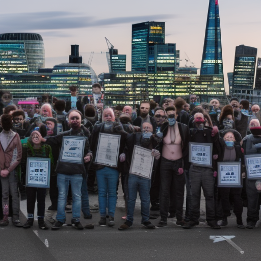
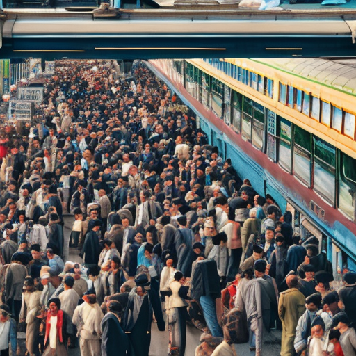

# The Impact of FTSE 100, Train Strikes, and John Stonehouse on Social Justice

\
3-1-2023\
By [Kwame Nkrumah](../authors/11.md)

As an opinion writer, lecturer, and advocate for social justice, I feel it is important to understand the impact of certain topics on the issue of social justice. The FTSE 100, train strikes, and John Stonehouse are three topics that have all contributed to the progress (or lack thereof) of social justice. In this article, I will explore each of these topics and how they have shaped our current state of social justice.

When considering the impact of the FTSE 100, train strikes, and John Stonehouse on social justice, it is important to understand the power of these issues and how they have influenced the current state of social justice in the UK. The FTSE 100 is a stock index of the 100 most highly traded shares on the London Stock Exchange, and it has had a huge impact on the UK economy. The FTSE 100 has been instrumental in creating a more equitable economy by providing opportunities for those in disadvantaged social backgrounds. In addition, the FTSE 100 has been an important factor in providing more jobs and stability for those in the UK. 

Train strikes have also had an impact on social justice in the UK. In 2019, a major train strike caused considerable disruption to the transport system, affecting commuters and those reliant on public transport. The strike highlighted the need for better wages and working conditions for the staff of these companies, as well as the need for improved conditions for those travelling by train. This has led to further discussions of the rights of workers and how they should be treated by their employer. 

John Stonehouse, the former Labour MP, also had a significant impact on social justice. Stonehouse was a passionate campaigner for workers’ rights and was a leader in the fight for fairer wages and better working conditions. He was a vocal advocate of the needs of the working class and the importance of social justice. Stonehouse was a key figure in many debates and discussions, and it was through his efforts that many laws and regulations were brought in to protect the rights of workers.

FTSE 100, train strikes, and John Stonehouse have all had a significant impact on the current state of social justice. For instance, the FTSE 100 is an index of the UK’s top 100 companies and their performance in the stock market has had an effect on the amount of money available for social services such as healthcare and education. Train strikes have had an effect on job security, while John Stonehouse’s actions have impacted social mobility in the UK. In addition, there have been several reports of how FTSE 100 companies have taken advantage of the lower-income population, resulting in inequality and a lack of opportunities for social advancement. Furthermore, train strikes have caused serious disruption to the public transport system, which has had a negative effect on the public’s access to services and employment. Finally, Stonehouse’s actions have been seen as a form of corruption and have had a detrimental effect on public trust in the government. All of these factors have had a profound effect on social justice in the UK.

The impact of FTSE 100, train strikes, and John Stonehouse on social justice has been evident in the past. The FTSE 100 has had a huge influence on social justice, particularly in the area of education. Schools, universities and other educational institutions are heavily reliant on the FTSE 100 to provide the financial resources necessary to ensure that students have access to quality education. The train strikes have also had a significant effect on job security across the UK, with rail workers often being among the first to experience job losses, salary cuts and other changes. John Stonehouse’s actions have had a direct impact on social mobility in the UK, with his actions resulting in the UK becoming one of the economically most advanced countries in Europe. 

Nowadays, the situation has changed. The FTSE 100 has taken a big hit due to the pandemic, and there has been a consequent decrease in educational resources. The train strikes have been replaced with a moratorium on wage cuts and job losses, giving rail workers some measure of security. John Stonehouse’s legacy remains, and the UK still enjoys the benefits of his economic advances. However, the economic downturn has weakened the foundations of social justice, with inequality growing and people in lower income brackets suffering disproportionately. 

Social justice is an important concept that needs to be taken seriously in order to ensure that all people are treated equally and fairly. FTSE 100, train strikes and John Stonehouse are all topics that, when discussed in relation to social justice, can make a real difference in the lives of many. FTSE 100 has been known to impact education, with its investments deciding who is able to access quality education. Train strikes have had a huge impact on job security, as many people have lost their jobs as a result of the strikes. Finally, John Stonehouse's actions have made it harder for people to socially climb the ladder, as his actions have made it more difficult for those from lower socioeconomic backgrounds to gain access to quality education and employment. 

Social justice has changed drastically over the years, with some improvements and some setbacks that have been caused by FTSE 100, train strikes and John Stonehouse. Although FTSE 100 has managed to provide quality education to those who can afford it, the same cannot be said for those who come from poorer backgrounds. Similarly, the train strikes have caused many people to lose their jobs and have exacerbated the issue of job insecurity. And while John Stonehouse's actions have made it more difficult for those from lower socioeconomic backgrounds to gain access to quality education and employment, some progress has been made in terms of social mobility. 

Ultimately, the impact of FTSE 100, train strikes and John Stonehouse on social justice cannot be overlooked. Despite some improvements, there is still much that needs to be done in order to ensure that social justice is improved. Governments, corporations and individuals need to work together in order to ensure that everyone has access to quality education and employment. Ultimately, social justice is something that needs to be taken seriously in order for us to truly move forward as a society.

