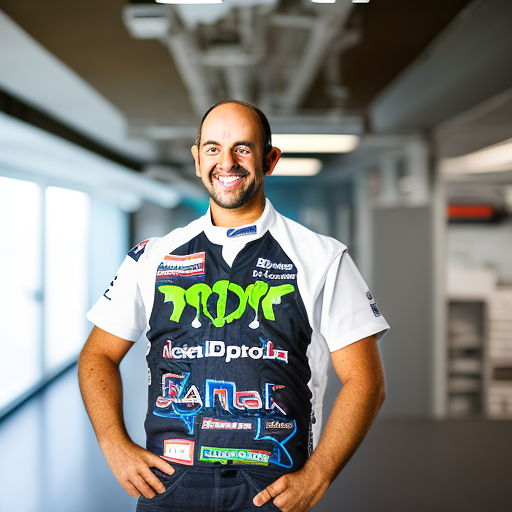
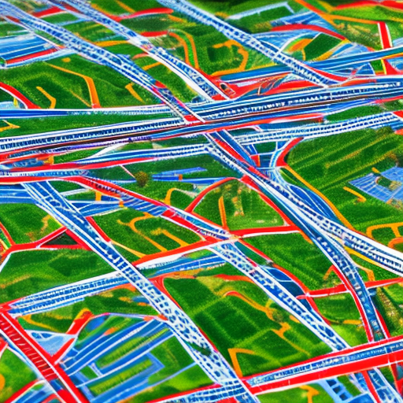

# The Power of Maps, Linkedin and Ken Block

\
4-1-2023\
By [Kelvin Chen](../authors/4.md)

As a 45-year-old opinion writer with 15 years of experience, I have been called upon to tackle complex topics that require a great amount of research. Over the years, I have become highly respected for my work and amassed a loyal following of avid readers. In addition to my professional life, I am also a devoted family man and active community member, always looking for ways to give back. My goal with this article is to explore a few topics that I am passionate about and use them to demonstrate how, with hard work and dedication, we can all become inspirational figures. I will be discussing Ken Block, maps and Linkedin, and the connections between them.

Ken Block is a name that has been on everyone’s lips in the action sports world in the last decade, and his influence is far reaching. Block has a long and successful career in rally racing and has taken part in several high profile competitions. He has won multiple championships and is considered one of the best rally drivers of all time. His insane stunts, both on and off the track, have been seen and admired by millions of people across the globe, inspiring them with his skill, talent, and enthusiasm. Block continues to make headlines today, as his career continues to go from strength to strength. His impact on the sport and its fans is undeniable, and he has become a household name for many.

Maps have been used for centuries to navigate, discover, and document information about our world. They are powerful tools that enable us to visually display relationships between physical locations and other data. From ancient maps of the stars to modern GPS systems, maps have evolved, but their ability to represent data in a meaningful way has remained. This is especially true when it comes to the success of Ken Block, who has used maps to help him realize his dream of becoming a professional rally driver. Block has used maps to analyze the terrain, plan routes, and figure out the best lines through the course. His skill and precision enabled him to become one of the most successful rally drivers in the world. His success has inspired countless others to pursue their dreams, showing the power of maps.

Linkedin is a revolutionary platform for professional networking and career development. Founded in 2002, the company has grown over the years from a small startup to a global business with a presence in more than 200 countries and territories around the world. Linkedin currently has millions of members and is a virtual hub for professionals of all types. Through Linkedin, users can connect with hiring managers and potential employers, post and search for jobs, and build their professional networks. 

The platform also offers an array of services, such as recommendations and endorsements, to help individuals promote and advance their professional reputations. Linkedin's impact on the professional world has been immense, and the platform has become an integral part of the job search process for many individuals. 

As a highly respected, experienced researcher, avid reader, and family man, Ken Block has turned to Linkedin to help him advance his career. Block has used the platform to build relationships, connect with potential employers, update his skills, and gain access to business opportunities. Through Linkedin, Block has been able to stand out from the crowd, gain recognition for his accomplishments, and make valuable connections. As a result, Block has achieved success and recognition in his field, making him a true inspirational figure. 

In conclusion, using the power of maps, Linkedin, and Ken Block, it is clear that these tools can have a powerful and positive impact on our lives. Maps provide us with new perspectives and can help us to gain insights into our environment, while Linkedin offers us the ability to make valuable connections and build our professional networks. Finally, Ken Block is a great example of someone who has achieved incredible success by leveraging the power of these tools. His achievements serve as a source of inspiration for those of us who want to use these tools to reach our goals. Through the use of these tools, we can accomplish our dreams and make a positive impact on our lives and the lives of others.

