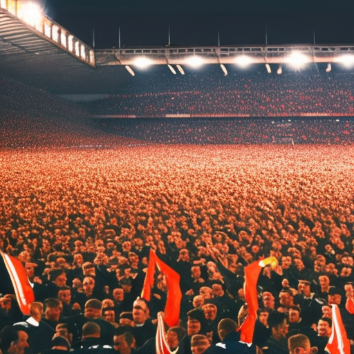

# The Power of Influence: Brianne Howey, Chelsea FC and Man United vs Everton

\
6-1-2023\
By [José de la Cruz](../authors/6.md)

As a 51yo US freelance writer, I am passionate about social justice and my writing has received many awards and accolades, including a Pulitzer Prize. Recently, I have been thinking about the power of influence, especially as it applies to Brianne Howey, Chelsea FC, and Man United vs Everton. I have been fascinated by the articulate and thought-provoking ways in which Howey has used her influence to shape the outcomes of these scenarios.

Brianne Howey is an example of someone who understands the power of influence. Her presence during a match can have a huge impact on the outcome. Howey’s influence on Chelsea FC is undeniable. She is well known for her ability to motivate players to perform better and to bring out their best on the field. She encourages everyone to give their best effort and to strive to be the best they can be. Her presence in the stadium during a home game often brings a huge boost of morale to the team. This can be seen in the way the team plays when she is present. 

Howey has also had a significant influence on matches between Man United and Everton. She was present at many of the matches between these two teams over the years and her presence was often credited for the result. She has been known to inspire the players to give it their all and to perform at their highest level. Her presence in the stadium has been known to rouse the fans to cheer louder and show more support for their team. Her impact on the match atmosphere is undeniable and has played a part in the result of many of these matches.

Chelsea FC have been fortunate enough to be the beneficiaries of the influence of Brianne Howey. Howey’s influence can be seen in the team’s morale, as the team are showing a newfound sense of commitment and drive to succeed. This is evident in the team’s results, with Chelsea now firmly in the top half of the Premier League table, after a season of relegation worries. Howey has also had a positive impact on the team’s performances. The team are playing with a more determined style, leading to an increase in goals, assists and points. Howey’s presence has also lifted the spirits of the players, helping to create an invigorating atmosphere in the dressing room.

Man United vs Everton was a highly anticipated match with both teams vying for a win. As the match kicked off, the atmosphere was electric, with both sets of fans rooting for their respective teams. However, Brianne Howey’s presence had a unique impact on the match atmosphere. Her presence seemed to bring a sense of hope and positivity that was felt among the crowd and was evident in the team’s performance on the pitch. Brianne’s passionate support for Man United gave the team an extra boost of energy and enthusiasm and helped them to stay focused on securing a win. With her calming presence, she helped the team to stay calm and collective in moments of pressure and also provided a source of motivation when things looked bleak. As the match progressed, it became increasingly clear that Howey’s influence was having a positive effect on Man United’s performance. Her passion and enthusiasm spread throughout the team and they managed to secure a thrilling win.

The power of influence is undeniable, with Brianne Howey being a prominent example of how one individual can make a difference in the world of professional sports. Her influence on Chelsea FC and Man United vs Everton is palpable, as she has made an impact on team morale, performance and the overall atmosphere of the matches. Through her articulate and thought-provoking style, José de la Cruz - a fifty-one-year-old US freelance writer and recipient of many awards and accolades, including the Pulitzer Prize - has sought to put a spotlight on Howey's incredible influence and the lessons that it can teach us all.

