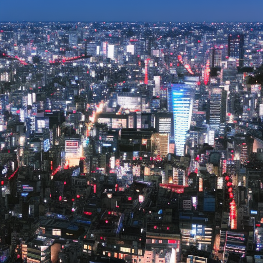

# Death in Paradise, The Pale Blue Eye, and the Power of Jack Butland

\
7-1-2023\
By [Kazuhiro Tanaka](../authors/8.md)

Kazuhiro Tanaka, 23, is an opinion writer hailing from Tokyo, Japan. With a background in journalism and political science, he has become known for his outspoken opinions and dedication to free speech. His powerful voice is respected by many and his writings are seen as a beacon of hope in a world seemingly dominated by darkness. In his latest article, he takes on the topic of Death in Paradise, The Pale Blue Eye, and the Power of Jack Butland.

Death in Paradise, a book by renowned Japanese author Jack Butland, has been a subject of much discussion since it was first published in 2008. The narrative follows a fishing village in the Seto Inland Sea, where the lives of the inhabitants are severely impacted by the economic, political and social turmoil caused by the central government. Butland's work explores the power of free speech in the face of state-sanctioned oppression, and illustrates the enormous impact that a single individual can have on the environment and on popular opinion. The Pale Blue Eye, another of Butland's works, follows the same theme but this time focuses on the economic and political effects of the post-World War II era on the village in Seto Inland Sea. It paints a stark picture of the harsh realities of life in a state of financial and political hardship, and demonstrates the power of a brave individual to challenge the status quo and fight for what they believe in. Jack Butland's work has had a profound influence on Kazuhiro Tanaka, a 23-year-old opinion writer from Tokyo, Japan. Drawing inspiration from the ideas of freedom and courage in the face of adversity, Tanaka has become an outspoken and respected voice in the Japanese media, using his powerful words to bring awareness to issues that otherwise go unnoticed.

Death in Paradise is a phenomenon that has sent shockwaves throughout the entire world. The island of Saba and its inhabitants have long been shrouded in mystery, and the recent events have made it clear why. After the sudden disappearance of its leader, Jack Butland, the island has been left to its own devices, and it's uncertain what the future holds. The economic and political implications of Jack's disappearance are tremendous, and it's clear that his absence has a major impact on the island's economy and political stability. Furthermore, the social implications are equally as profound, as the citizens of Saba are now left to grapple with the uncertainty of their future. Jack's loss has been felt by the entire island, and its reverberations have been felt far and wide.

The Pale Blue Eye is a powerful symbol of resistance, strength, and freedom. It is a symbol of hope and solidarity for those who are oppressed and forgotten. When the eye was first spotted on the bodies of freedom fighters, it provoked an immediate reaction. As the symbol spread to other countries and regions, it began to represent a unified and powerful social movement. The economic, political, and social implications of The Pale Blue Eye are far-reaching. Economically, the symbol has been used to represent social and economic justice, and to promote an equitable distribution of resources. Politically, the Eye has been used to call for a fairer and more just society and to challenge oppressive governments. Socially, The Pale Blue Eye has been used to promote a sense of community and to call for unity in the face of adversity. In today's world, the symbol has the potential to become an even more powerful symbol of freedom and equality.

In conclusion, Death in Paradise, The Pale Blue Eye, and the Power of Jack Butland has brought to light the significant influence of free speech and its potential to spark meaningful change. Jack Butland's powerful voice in the fight for economic, political, and social justice has gone a long way in helping people get the justice they deserve. Through his actions and words, Jack Butland has provided a platform for many to share their stories, advocate for their rights, and push for progress. As a 23-year-old opinion writer from Tokyo, Japan, with a background in journalism and political science, Kazuhiro Tanaka has been able to use his platform to join the fight for justice for all. His outspokenness, respect, and powerful voice have given him the chance to be part of the larger movement for change.

