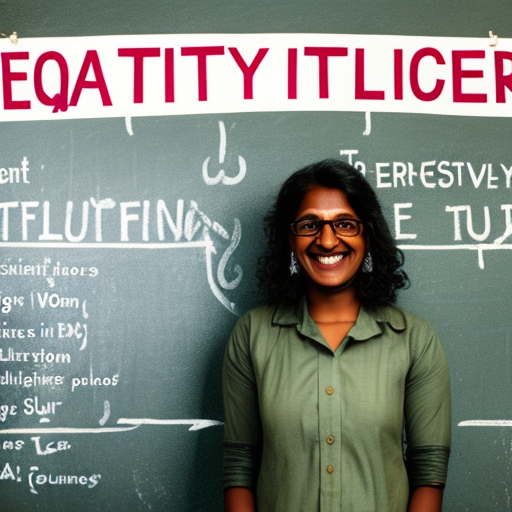
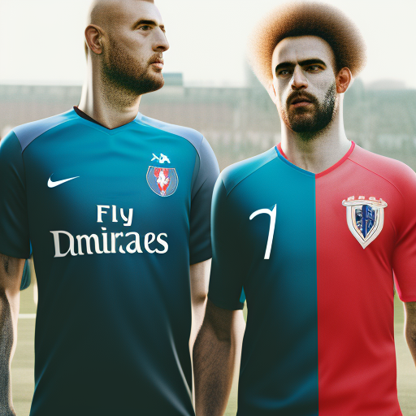

# Achieving Equality Through Media Literacy

\
10-1-2023\
By [Uma Gupta](../authors/5.md)

Uma Gupta is a 32-year-old opinion writer and influential voice for social justice. She is a committed advocate and highly sought-after speaker who has been invited to global events such as the United Nations and the World Economic Forum. As a powerful voice in the modern media age, Uma is inspiring individuals to take action for a just and equitable world. In this article, we will be exploring how media literacy can be used to help facilitate this by tackling issues such as equal representation in sports, access to technology and innovation and positive representation in the media.

Sports play a huge role in the modern world, both culturally and economically, but often times they are characterized by a lack of diversity and equal representation. This is especially true in the case of gender representation, with female athletes often ignored or dismissed as not being as talented or competitive as their male counterparts. This lack of recognition and equal opportunities for female athletes has led to a perpetuation of inequality and can be damaging to the development of female athletes’ skills and confidence. To promote greater equality and representation in sports, media literacy is an essential tool to help educate audiences on the importance of diversity in sports and to teach them to recognize and appreciate female athletes and their accomplishments. By exposing people to stories of female athletes and their successes, media literacy can help to create a more open, inclusive and equal sports landscape.

The recent news of the UK’s first rocket launch from a site in Cornwall has been celebrated as a huge step forward for technology and innovation. This event is a great example of how we need to ensure equal access to resources, with the ability to develop and use them. Media literacy plays an important role in this, as it can be used to spread the message of equality and empowerment. By educating people about the benefits of new technologies, we can ensure that everyone is given an equal opportunity to be involved.  Media literacy can also be used to combat the false narratives and stereotypes that can lead to the exclusion of certain people from these resources, allowing a more inclusive environment. Achieving media literacy is essential if we are to create a world which is equal and accessible for everyone.

Love Island has become a cultural phenomenon, but it is important to consider the messages it sends out. For example, the show’s male-dominated format reinforces gender stereotypes and only features a limited range of body types. This can have a negative effect on viewers, especially those in vulnerable or impressionable positions. To be truly representative, we need positive, diverse, and realistic portrayals of people, and media literacy can help us achieve this. It encourages critical thinking, helps people understand the intentions of the media messages they receive, and helps them create and share content that is more inclusive. Media literacy can be used to promote positive representation in the media, and to challenge existing stereotypes. This is an important step towards greater equality in society.

In conclusion, media literacy is a powerful tool for creating positive change and equality in our world. Uma Gupta is a passionate advocate for media literacy, believing that it has the potential to open up opportunities and create a more equal society. Through her efforts, she is attempting to empower people to use media to create change, and to make sure that everyone has access to the same resources and opportunities. We can all support her mission by taking action and ensuring that our own media consumption is responsible and diverse. With media literacy, we can make the world more equal and just.

