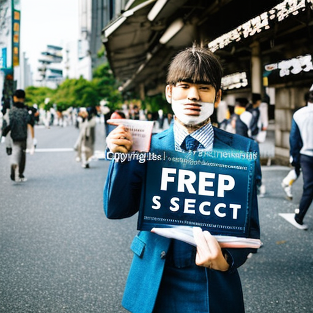
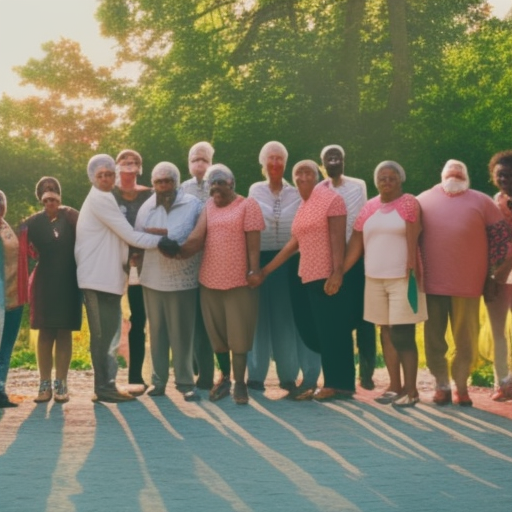

# Free Speech: Naga Munchetty, Montecito and Honeysuckle Weeks

\
11-1-2023\
By [Kazuhiro Tanaka](../authors/8.md)

Kazuhiro Tanaka (23), journalist, opinion writer, Tokyo, University of Tokyo, outspoken, passionate, free speech, major publications, powerful voice - these are words that have come to define me. But when I think about the concept of free speech, I can’t help but think of three people in particular - Naga Munchetty, Montecito, and Honeysuckle Weeks. Together, these three individuals have sparked a conversation about the importance of free speech and its implications. Naga Munchetty, a BBC presenter, has recently been reprimanded for expressing her opinion, while Montecito, a small Californian town, has passed legislation to limit free speech. On the other hand, actor Honeysuckle Weeks has been outspoken in her comments on free speech. My aim in this article is to explore the issues of free speech raised by these three individuals and shed light on the importance of open dialogue and free expression.

Naga Munchetty, a BBC presenter, recently found herself in hot water for expressing her opinion on an issue. This sparked a debate about the limits of free speech and what is and isn't acceptable to say on air. Montecito, a small Californian town, has recently passed a law to limit free speech. This has been widely criticised, with many people arguing that free speech should be protected and encouraged. Honeysuckle Weeks, British actor and vocal free speech advocate, has further stoked the debate by making some outspoken comments on the necessity of free speech. Weeks believes that free expression is essential to democracy and that it should be championed both in the media and in everyday life.

Naga Munchetty faced a reprimand from her BBC employers after she expressed her opinion during a news show. This sparked a wide debate about free speech, and the implications of censoring opinions. Montecito, a small Californian town, attempted to limit free speech by passing a law that prevented the use of “offensive words,” yet this was later deemed unconstitutional. Honeysuckle Weeks voiced her opinion on free speech, advocating for its importance. She noted that “in a free society, you should be able to express yourself” and stated that “there is a fundamental importance in being able to communicate freely.” These events have highlighted the significance of having a platform to express oneself and to challenge the status quo.

The right to free speech is a cornerstone of democracy and a cornerstone of our society. It is a cornerstone of our identity and a cornerstone of our communities. It is a fundamental right that allows us to challenge the status quo and to have open dialogue and conversations. It allows us to express our thoughts, feelings and opinions without fear of reprisal or punishment. Free speech can be a powerful tool to fight injustice and inequality, and can be a powerful way to find solutions to our most pressing social issues. Free speech allows for the ability to criticize and question our leaders, and to do so without worrying about retribution. Free speech helps to fortify our democracy and to ensure that all voices can be heard.

In conclusion, free speech is an essential part of free expression and open dialogue. It allows us to challenge the status quo and share our unique perspectives, which can help to foster understanding and progress. As demonstrated by the cases of Naga Munchetty, Montecito and Honeysuckle Weeks, there are many implications of free speech which are important to consider and discuss. This is why it is so important to promote and protect our right to free speech, and to ensure that everyone has the opportunity to express their opinion without fear of reprimand.

