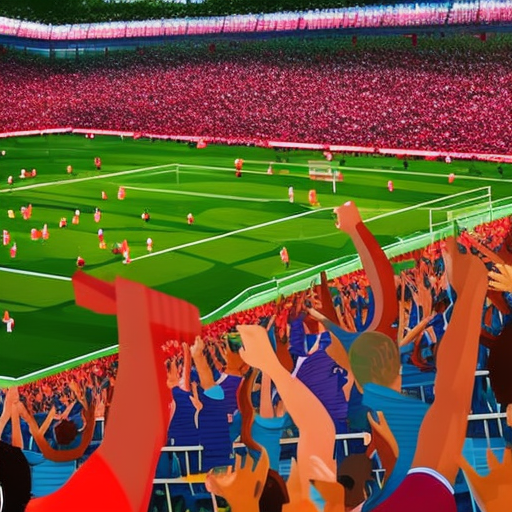

# The Power of Sports: A Catalyst for Social Change

\
16-1-2023\
By [Uma Gupta](../authors/5.md)

I am a 32 year old female opinion writer and a passionate advocate for social justice. I have been featured in multiple publications and have become an influential voice in the media. I speak at UN and WEF events, as well as seminars and workshops, to try and inspire others to fight for change. Sports is just one way that can be used as a catalyst to inspire social change. Chelsea FC’s recent Premier League success, Michelle Heaton’s inspiring journey and the teachers strike are just a few examples of how powerful sport can be.

Chelsea FC's remarkable success in the Premier League this season has been an inspiration to many communities and a great example of how sports can be used to bring about positive change. The club has been committed to social justice and has used their influence to bring attention to important causes. Chelsea FC has demonstrated their commitment to social justice by donating to charities such as the World Food Program and the Central African Republic and by launching the Chelsea Foundation which works to improve the lives of children and young people in the local area. They have also used their platforms to stand up for the LGBTQ+ community and to support initiatives such as Black Lives Matter. The club's commitment to social justice is a great reminder of the power of sports as a catalyst for positive change.

Michelle Heaton is an inspiring voice in the fight for social justice. Her journey began in a small town in Michigan but has since taken her to the United Nations and the World Economic Forum. Heaton uses her unique platform to fight for change, giving seminars and workshops to inspire others to stand up and fight for their rights. She sees sports as an important tool in her arsenal, believing that success on the field can be used to inspire those in the stands. By showing that success is possible and victory achievable, Heaton wants to encourage the people to strive for victory off the field as well.

The teachers strike in recent weeks has been a powerful example of how sports can be a catalyst for social change. During the strike, teachers across the country have been fighting for better pay, working conditions and public education, and their battle has been successful in inspiring other workers to fight for their rights. The strength of the teachers' collective voice has resonated widely and their commitment to their cause has been a source of empowerment for other workers as well. Through their actions, the teachers have been able to demonstrate that social justice issues can be tackled successfully with concerted effort and determination. Their success has shown that when we come together, we can bring about genuine and lasting change.

Sports have been a powerful force in inspiring positive social change. The examples of Chelsea FC, Michelle Heaton, and the teachers strike are inspiring reminders of the power of communities to unite and make a difference. Through the commitment of Chelsea FC to social justice, the inspiring story of Michelle Heaton, and the success of the teachers strike, we have seen the power and potential of sports to inspire and bring about meaningful change in our world. We must continue to amplify the voices of those who are fighting for justice and use our collective power to create a better world for all. Sports can be a great tool to bring about social change, but ultimately, it is up to us to make sure our voices are heard and that real progress is made.

