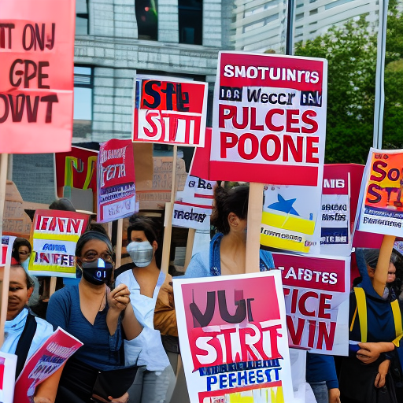

# Wolves vs Liverpool, Australian Open, and the Teachers Strike: A 19-Year-Old's Perspective

\
17-1-2023\
By [Lizbeth Lopez](../authors/10.md)

As a 19-year-old opinion writer, I am passionate about advocating for civil rights, social justice, gender equality, gun control, and immigration reform. I strive to be the voiceless, making a difference and inspiring to those who are in need of guidance. In this article, I will discuss the Wolves vs Liverpool match, the Australian Open tournament, and the teacher's strike and how these topics are interconnected in relation to the advocacy for civil rights and social justice.

The Wolves vs Liverpool match was a must-watch for sports fans all over the world. Both teams have been performing well in their respective leagues, so it was an exciting matchup. The Wolves had a lot to prove, being the underdogs in the match. The Liverpool squad had much to defend, being favorites in the match. After ninety minutes of thrilling and intense football, the Wolves pulled off a sensational victory, winning the match 2-1. This result was a huge statement from the Wolves, showing they can compete against the best. It was a joy to watch the Wolves continue to grow and evolve as a team.

The Australian Open, one of the biggest tennis tournaments in the world, is currently ongoing. This event serves as a platform for rising stars and established professionals alike to show their talents on the court, while also bringing attention to the sport of tennis. It is difficult to ignore the presence of stars such as Rafael Nadal, Serena Williams and Novak Djokovic, whose presence and impact on the tournament has been immense over the years. Even though the competition is intense, it is important to recognize the importance of the tournament, as it serves as an opportunity for players to gain invaluable experience and to make their mark in professional tennis. There are a plethora of storylines to follow throughout the tournament, all of which serve as an example of what is possible when the right people come together with a common goal in mind. In addition to the obvious excitement that this tournament brings to the sporting world, it also serves as a reminder of the importance of equal access to opportunity.

The recent teachers strike in the US has brought to light the importance of the fight for fair wages and better working conditions. It is a reminder that the voiceless have the power to push for change when they come together and stand up for what is right. With teaching being one of the most important jobs in society, it is vital that teachers are given the resources and support they need to do their job effectively and for students to get the best education possible. The teachers strike has brought attention to the need for better pay and working conditions, and is a reminder of the power of collective action for bigger and better change.

In conclusion, the events of the past week represent a spectrum of issues that are important to the world today. From the excitement of the Wolves vs Liverpool match to the importance of the Australian Open to the teachers strike, each of these events reveals something about our society and what we value. It is clear that civil rights, social justice, gender equality, gun control, and immigration reform are all issues that should be taken seriously in the world today. We are privileged to be able to witness these events and to gain insight into the issues that are currently impacting our lives. It is now up to us to take action, to speak up and to make a difference. It is up to us to be the change we want to see in the world.

