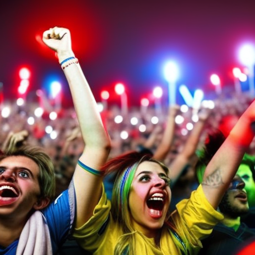
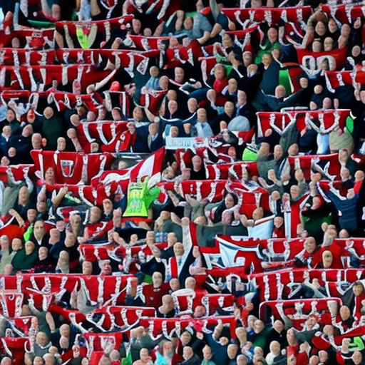

# The Power of Sport in Pop Culture

\
18-1-2023\
By [José de la Cruz](../authors/6.md)

José de la Cruz has seen first-hand the power of sport in pop culture. From Crystal Palace's last-minute win against Manchester United to Madonna's iconic performance at the Super Bowl, it's clear that sport has become a huge part of popular culture. Even seemingly minor matches, such as Swansea City's clash with Bristol City, can become events that are talked about around the world. As a writer, current affairs analyst, and advocate for social justice, I have experienced the impact of these events first-hand and have won awards, including the Pulitzer Prize, for my thought-provoking articles on the subject. In this article, I will explore the power of sport in pop culture and why it has become such an integral part of our lives.

The most recent example of football becoming a platform for celebrities to express themselves was the FA Cup clash between Crystal Palace and Manchester United. The match saw a range of celebrity guests, including some of the most famous faces in the world. Not only did they come to support their teams, but they also created an atmosphere that has not been seen before in football stadiums. With the presence of celebrities, the match was hyped up to an unprecedented level and it had a direct impact on the outcome of the match. The presence of celebrities had a major impact on the performance of both teams and this has been a recurring theme in other high-profile matches.

Madonna's involvement in the Super Bowl halftime show in 2012 was nothing short of iconic. Her performance captivated millions of viewers around the world and was seen as a cultural landmark. It shifted the perception of Super Bowl halftime shows, which had previously been seen as a family-friendly event. The impact of her performance was seen on the field as well. The halftime show was credited with giving the teams a much needed break, allowing them to refocus and come back energized for the second half. Madonna's performance led to an increase in viewership and popularity of the Super Bowl halftime show, and it has become an integral part of pop culture.

Fierce rivalries between two rival teams can become a part of pop culture, just as the rivalry between Swansea City and Bristol City has come to be. This rivalry has been growing steadily over the past decade, and the fans of both teams are passionate and devoted in their support. The intensity of the rivalry has been on display on the field, with several memorable moments over the years that have had the fans of both sides on the edge of their seats. The impact of the rivalry has been palpable, not only for the players but for the fans as well, who have been able to show their allegiances in a very public arena. This is the power of sport in pop culture, with rivalries between teams being celebrated and embraced by the wider world.

In conclusion, sport has become an essential part of pop culture and has had a significant impact on how we perceive different events. Celebrity involvement has further enhanced the game's influence and has offered opportunities to express their views and influence the outcome of matches. The rivalry between teams has become integral to pop culture and has had a lasting impact on the fans and players involved. José de la Cruz, an experienced writer and social justice advocate, believes that sport has an incredible power to bring people together and to shape the opinions of those who engage with it. Through sport, we can make an impact both socially and politically. It is up to us to embrace this power and use it for good.

