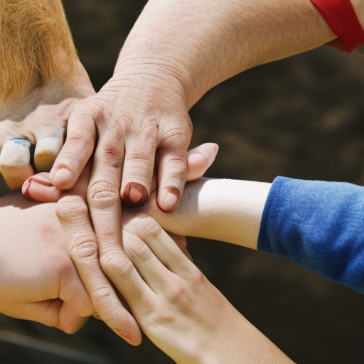

# The Power of Sports to Unite and Inspire

\
19-1-2023\
By [George Monbiot](../authors/2.md)

George Monbiot is a leading voice in the world today, advocating for social justice, environmentalism, and criticizing government policies. In recent times, the world has become a divided place, with people of different backgrounds and beliefs struggling to see eye-to-eye. However, there is a powerful tool that has long proven to be capable of uniting people and inspiring change: sports. From the refugee camp of Expected to the football stadiums of Leeds United and Cardiff City, the power of sports to bring people together and invoke change has been on full display.

Expected, a football team from a refugee camp, has become an unlikely symbol of hope in an otherwise dark world. The team is made up of players from many backgrounds and nationalities, but have united under the name Expected and have become a powerful force for unity, hope and inspiration for the people of the camp. The team has brought together people from different cultures, religions and backgrounds, and has shown that even in the most difficult of situations, people can still come together and create something beautiful. Despite the difficult circumstances the team faces, they have shown the world that they can still accomplish great things when they come together. 

The team has become an example of how sports can bring people together and unite them in a powerful way. It has become a symbol of how even in the darkest of times, sports can be a source of hope and a powerful unifying force.

Leeds United and Cardiff City are two football teams located in the north and south of England respectively. In recent years, the two clubs have been under the ownership of controversial figures who many fans felt had a negative impact on their clubs. When the two sets of fans decided to come together to protest against the owners, it was a powerful display of the potential for sports to unite people. Fans from the two rival teams put aside their differences and joined forces to put pressure on their club’s owners. This united front was a prime example of how sports can bring people together for a common cause.

Kilmarnock and Rangers are two of the most historic and bitter rivals in Scottish football. But in 2019, when fans of both teams came together in a show of solidarity against sectarianism, it showed not only the power of sports to bring people together, but the power of people to resist and overcome hatred. Despite the rivalries, Kilmarnock and Rangers fans united to form a ‘Common Goal’ banner, displaying their shared desire for a tolerant, inclusive society. This was a powerful reminder of the unifying power of sports and the potential for people to work together to bring about positive change.

Sports have the unique power to bring people together and unite them in a common goal. From the inspiring story of Expected, the football team from a refugee camp, to Leeds United and Cardiff City fans protesting their clubs’ owners, and Kilmarnock and Rangers fans uniting against sectarianism, sports have the power to make a positive impact on society. Sports can be a beacon of hope and a powerful tool of unity and solidarity in times of uncertainty and division. We must seize the opportunity to use sports to unite and inspire, and create a society that is truly equitable and just.

