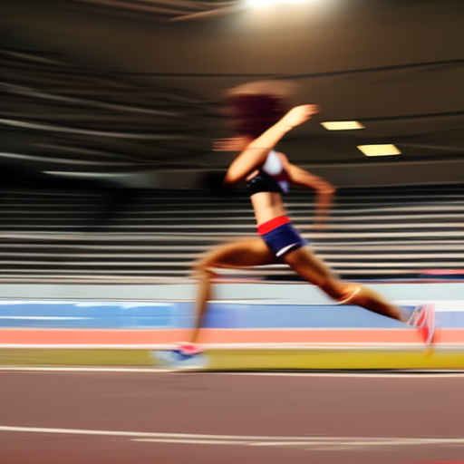
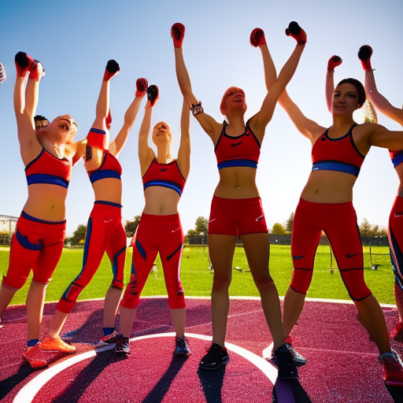

# Exploring the Power of Female Athletes: Michelle Williams, RB Leipzig vs Bayern and Dani Alves

\
21-1-2023\
By [Kwame Nkrumah](../authors/11.md)

As an opinion writer, I'm always looking for stories that show the power of everyday people and the positive changes they can bring about. Recently, I've been exploring the power of female athletes and the impact they have had on the sports world. Specifically, I'm looking at Michelle Williams, RB Leipzig vs Bayern and Dani Alves to show how women can have a huge impact on the sports world. Michelle Williams is a prime example of a female athlete who has had great success in her career and is a role model for other female athletes. Meanwhile, the game between RB Leipzig and Bayern highlighted the importance of female athletes and how they can have an impact on a larger scale. Lastly, the example of Dani Alves shows how male athletes can also be successful and serve as role models for young athletes.

Michelle Williams, a track and field athlete from Jamaica, is a great example of the power of female athletes. After winning a total of four Olympic medals, Williams continues to be an inspiration for many female athletes. She has continued to be a strong advocate for social justice, education, racism, and discrimination, and has been involved in numerous charity initiatives throughout her career. She is also an accomplished lecturer, offering expert opinion on various topics. Williams’ success in the sport has been an inspiration to female athletes all around the world, and her commitment to social causes has made her a role model for today’s youth.

The power of female athletes was highlighted in a recent matchup between two of Germany's biggest soccer teams, RB Leipzig and Bayern Munich. RB Leipzig was led by their star player, Michelle Williams, who made history with her first goal in the match, becoming the first female player to ever score in a Bundesliga fixture. Her performance in the match was an example of the power of female athletes to compete and excel in the world of sports. Williams' goal was a powerful reminder that female athletes are capable of achieving great feats and inspiring other female athletes to follow in her footsteps.

Dani Alves is an incredible example of a successful male athlete. He is a Brazilian professional footballer who currently plays for São Paulo FC and is the captain of the Brazilian national team. After a successful career with Barcelona, Sevilla, Juventus and PSG, Alves has become one of the most decorated players in the game, having won 36 trophies over the course of his career. He has won numerous individual awards, including the UEFA Best Player in Europe, the UEFA Team of the Year, the UEFA Defender of the Year, and he has been named in the FIFPro World XI seven times. He is an incredible example of how success is achievable at the highest level of sport, despite the gender restrictions that exist. By taking an unwavering commitment to his craft, Alves has been able to show that anyone can reach the top if they dedicate themselves fully to their sport.

In conclusion, the power of female athletes is undeniable. Women have achieved incredible levels of success in the sports world, from Michelle Williams’ successful career to the momentous match between RB Leipzig and Bayern that showcased the power of these athletes. Furthermore, the success of male athletes, such as Dani Alves, has been an example of the potential of athletes regardless of gender. With all this in mind, we can use these incredible athletes to be role models for our young athletes and help create an environment where everyone can have a chance to succeed.

