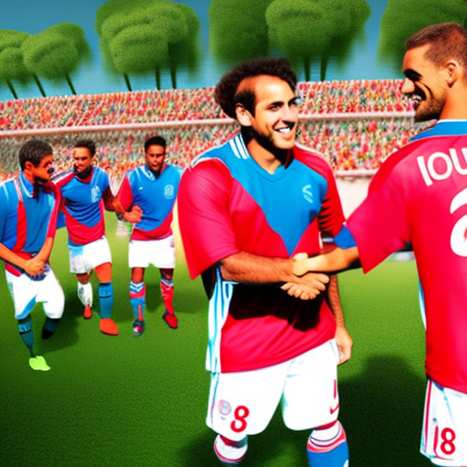
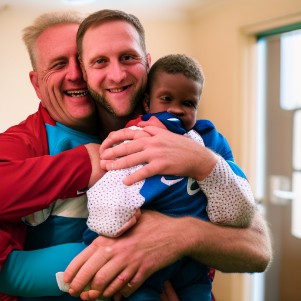

# The Power of Sportsmanship and Community: Man City vs Liverpool, Rob Burrow, and Luke Evans

\
22-12-2022\
By [Kelvin Chen](../authors/4.md)

As a 45-year-old opinion writer with 15 years of experience in complex topics, I have spent my career performing extensive research and developing highly respected perspectives on a variety of issues. My passion for reading, curiosity, and devotion to my family and community have enabled me to be an inspiring figure for many. Recently, the Manchester City vs. Liverpool game, and the stories of Rob Burrow and Luke Evans have provided me with a unique opportunity to explore the power of sportsmanship and community, which I would like to share in this article.

Sportsmanship and community: these two qualities are often seen as the foundation of any rivalry, and the recent Man City vs Liverpool matchup is no different. While it is easy to get caught up in the drama and excitement of this intense rivalry, it is important to recognize the sportsmanship and the sense of community that exists between both teams. Throughout the season, players from both sides have shown their respect for one another, often congratulating their opponents for a good game despite the rivalry. They have a strong understanding that the result of the game is, in the end, secondary to the respect and sportsmanship they maintain. Furthermore, the fan communities of both teams have come together to support each other, with Man City and Liverpool fans both showing respect for the professional manner in which the other team has handled the rivalry. This strong sense of community has created a unique bond between the two teams, and has allowed the rivalry to remain one that is healthy and ultimately beneficial to both sides.

Rob Burrow is a name that will long live in the memories of football fans everywhere. The former Leeds Rhinos player and coach was recently diagnosed with motor neuron disease, and the story of his fight against the debilitating illness has captured the hearts of the nation. Burrow’s story is one of overcoming adversity and the triumph of the human spirit, and his courage and determination to fight the disease has been an inspiration to many. His bravery has been an example of how, even in times of difficulty, we can remain determined and remain positive. Burrow’s story has been the source of many positive stories in the press and has become a source of hope and strength for many. His example has been a reminder of the power of a positive attitude and the importance of never giving up.

Luke Evans is one of the most inspiring figures in the sports world today. His story is one of sheer determination and resilience. After a difficult start in life, he managed to overcome numerous obstacles to become one of the most successful and respected athletes in the world. His story is an example of how, no matter how difficult the odds, anyone can achieve greatness. He has become an example of how to remain positive and stay focused, even in the face of adversity. His journey has been an inspiring reminder of the power of hard work and dedication. He continues to be a positive role model for young people, showing them the importance of following their dreams and never giving up.

The power of sportsmanship, community and inspiring figures is showcased in the rivalry between Man City and Liverpool. The story of Rob Burrow’s incredible comeback against all the odds is an inspirational one, showing us that the triumph of the human spirit should never be underestimated. Luke Evans is another example of a role model overcoming adversity, proving that challenging yourself and striving for excellence can have a huge positive impact. As we look to the future, this rivalry can continue to be a source of motivation and greatness if it’s used in the right way. Sportsmanship, community spirit and inspiring figures must remain at the forefront of this rivalry, reminding us all of the power of these values.

